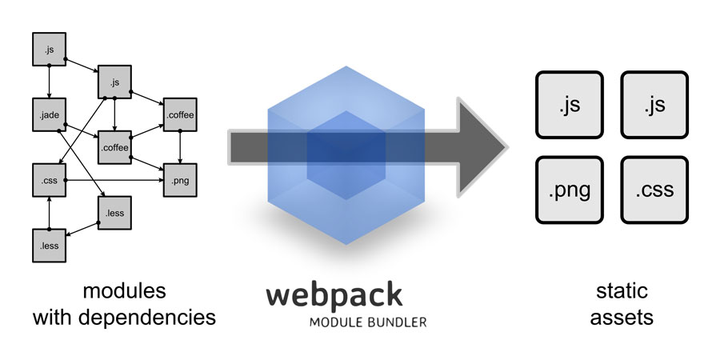
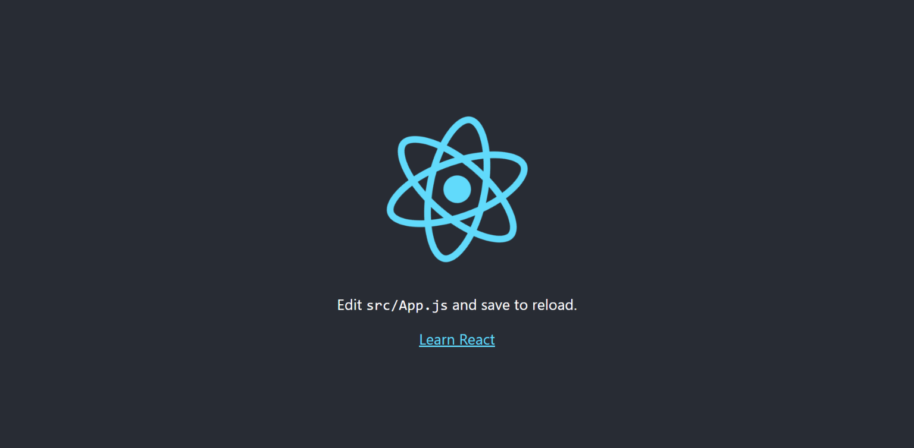

# React.js Türkçe Kaynak

## Giriş ve Tanışma

React.js ile ilgili içeriklere başlamadan önce kısaca kendimden bu kaynağın yapılış amacından bahsedeyim. İsmim **Orçun Tuna**, yazılım mühendisi adayıyım. Bu kaynak ile sizlerin günümüzün en popüler ön yüz kütüphanesi olan React'ı öğrenmesini amaçlıyorum. Bu projenin çıkış noktası ise ücretsiz yazılım kaynakları sunan goalkicker oldu. Aynı şekilde Türkçe olarak da detaylı bir kaynak olması açısından bu dökümanı baz alarak bu kaynağı hazırlamaya başladım. Bahsettiğim kaynak üzerindeki bilgileri çeviri ile sizlere sunmayacağım. Kendim düzenlemeler, eklemeler ve çıkarmalar yapacağım. Ama genel olarak rotamızı oradan kopya çekerek ilerleteceğiz. Bu kaynak GitHub üzerinde paylaşılacağı için eksik veya yanlış gördüğünüz yerleri "pull request" göndererek kaynağı iyileştirmeme yardımcı olabilirsiniz.

## Nelere İhtiyacımız Olacak?

React bir javascript kütüphanesi ve javascript platform bağımsız çalışan bir dil olduğundan işletim sistemi olarak herhangi bir kısıtlamamız yok. Aynı şekilde editör tarafında da birçok editör veya ide arasından seçim yapabilirsiniz. Geliştirme yaparken kullanabileceğiniz birkaç editörü yazalım bunlar arasından tercihinizi siz yapın.

- Visual Studio Code

- WebStorm (ide)

- Atom

- Sublime Text

- Brackets

Benim tavsiyemi soracak olursanız eğer öğrenci iseniz JetBrains ürünlerinden ücretsiz faydalanarak WebStorm kullanmanızı öneririm. Değilseniz üzülmeyin, VS Code'da çok kaliteli ve işinizi fazlasıyla görecek bir editör.

Kurulum tarafında ihtiyacımız olacak yazılım ise NPM ve Node.js olacak. Bunları da kolaylıkla indirip platform bağımsız şekilde kurabilirsiniz.

Geldik programlama dillerine, aşağıdakileri bilmeden maalesef react öğrenmeye başlayamazsınız. Eğer listedeki dil veya kavramlardan eksiğiniz var ise öncelikle bunları tamamlayıp sonrasında buraya dönmenizi tavsiye ederim. Aksi halde çoğu şeyi anlayamayabilirsiniz.

- HTML

- CSS

- JavaScript + Biraz da olsa ECMAScript

## React Nedir?

React, Facebook tarafından geliştirilen ve açık kaynaklı bir front-end kütüphanesidir. Ayrıca daha önce duymuş olabileceğiniz "component based" yani bileşen tabanlıdır.

Ayrıca React DOM'u kullanarak sanal bir DOM (Document Object Model) oluşturur. Bu sayede sayfa üzerinde bir değişiklik olduğunda tüm sayfayı güncellemek yerine sadece değişiklik yapılan kısmı güncellerek. Böylelikle performans tarafında fark gerçek DOM'a göre daha hızlı çalışır.

React içerisinde JSX adı verilen özel bir biçimlendirme dili kullanılır. React bu JSX kodlarını HTML kodlarına dönüştürür ve tarayıcı tarafından çalıştırılmasını sağlar. JSX denildiğinde gözünüz korkmasın. Neredeyse birebir olarak HTML şeklinde fakat kendine özgü birkaç özelliği daha olan bir biçimlendirme dili.

İlk paragrafta basettiğim bileşen tabanlılık özelliği ile geliştirme tarafında büyük kolaylıklar sağlar. Bunu şu şekilde basit bir örnek ile açıklayabiliriz. Bir yemek tarifi sitesinin anasayfasını düşünelim. Header, footer, sidebar ve yemek tariflerinin bulunduğu kartlar var. Buradaki her bir alanı bir bileşen olarak böleriz ve bunları tekrar tekrar kullanabiliriz. Header bileşeni, yemek tarifi kartı bileşeni ve bu şekilde bileşenleri oluştururuz.

Bu kısımda son olarak react'ın neden bir framework değilde kütüphane olduğunu konuşalım. Framework ve kütüphane ayrımı front-end tarafında içinde router bulunup bulunmadığına bakılarak karar veriliyor. React.js içinde varsayılan olarak bir router bulunmadığı için react'a kütüphane diyebiliriz. Router kısmını ise ileride react-router veya next.js gibi ekstra çözümler ile halletmeye çalışacağız.

## Webpack ve Babel Kavramları

Geliştirmeye başlamadan önce webpack ve babel kavramları hakkında bilgi sahibi olunması gerektiğini düşünüyorum. Şayet bunları sıklıkla kullancağız ve ne olduklarını bilmeden kullanmamız saçma olacaktır.

### Webpack



Bildiğiniz gibi javascript üzerinde farklı kodları içeri aktarıp bir dosya üzerinden kodlamaya devam edebileceğimiz bir sistem mevcut değil (Python'daki import, PHP'deki include gibi). Burada webpack devreye giriyor. Webpack oluşturduğumuz dosyalar arasında içeri aktarma yapmamızı sağlıyor. Sonrasında ise bir bundle dosyasında tüm içerikleri bir araya getiriyor. Böylelikle javascript üzerinde import işlemi yapabilmiş oluyoruz.

### Babel

Gereksinimler kısmında javascript yanında biraz da ecmascript demiştik. Babel'in görevi ecmascript üzerine ve bu yüzden ecmascript'e biraz hakim olmak gerekiyor.

Şuanda kullandığımız tarayıcılar tam olarak bütün ecmascript sürümlerini maalesef destekleyemiyorlar. Bu yüzden tarayıcının bizim kodlarımızı anlayabilmesi için ecmascript kodlarını daha düşük ecmascript versiyonlarına çevirmemiz gerekiyor.

Babel tam olarak bu işi yapıyoruz. Böylelikle daha modern ve anlaşılır kod yazabiliyoruz.

## Kurulum ve create-react-app

Yeni bir react projesi oluşturmak için create-react-app paketini kullanacağız. Paket kullanılmadan manuel olarak da react projeleri oluşturulabilir. Fakat hem çok fazla kullanılmadığı hem de başlangıçta kafa karışıklığına sebep olmamak için bu kısımdan bahsetmeyeceğim. Direkt olarak kurulumumuzu create-react-app paketini kullanarak yapacağız.

create-react-app paketi Facebook tarafından sunulan react proje oluşturma aracı. Bu aracı kullanarak manuel olarak yapmamız gereken her şeyden kurtulacağız. Paket bize hazır olarak şunları sağlıyor:

1. ES6 ve JSX çevrimi

2. Geliştirme sunucusunda değişiklik yapıldığında otomatik yenileme

3. Kodlama standartları ile çalışma (eslint)

4. Otomatik CSS tamamlama

5. JS, CSS ve Görsel dosyaları paketleme

6. Jest Unit Test ortamı

Kuruluma başlamak için gereksinimlerdeki npm uygulamasını yüklemiş olmanız gerekiyor. Bundan sonraki kısımlarda işlemlerimizi terminal üzerinden yürüteceğiz. Eğer Linux tabanlı bir işletim sistemi kullanıyorsanız sisteminizin kendi terminalini kullanabilirsiniz. Windows kullanıyorsanız "Git bash" kullanmanızı tavsiye ederim. Eğer onu kullanmayacaksanız cmd yerine powershell kullanın. Böylece en azından komutları farklılık olmadan -umuyorum ki- çalıştırabilirsiniz.

```bash
npx create-react-app ilk-uygulama
```

Bu komut ile proje dosyalarını oluşturduktan sonra proje dizinine gidelim ve uygulamamızı ayağa kaldıralım.

```bash
cd ilk-uygulama
npm start
```

Şuanda yerel sunucunuzda react çalışır durumda olması gerekiyor. Otomatik olarak tarayıcınızda bağlantı açılacaktır eğer açılmaz ise, tarayıcınızda adres çubuğuna **http://localhost:3000** yazarak bağlanabilirsiniz. Karşılaşmanız gereken ekran şu şekilde olmalı:



package.json dosyasını incelerseniz "scripts" kısmında kullanabileceğiniz bazı komutlara rastlayacaksınız. Buradaki start, build, test ve eject komutlarını kısaca inceleyelim.

- **npm run start:** geliştirme ortamında react uygulamasını ayağa kaldırır.

- **npm run build:** geliştirme ortamından canlı ortalama transfer için build işlemini gerçekleştirir.

- **npm run test:** projemize dahil olan jest ile hazırladığınız testleri çalıştırır.

- **npm run eject:** proje dosyaları içinde görmediğimiz server ve config dosyalarını manuel olarak yönetmek için dışarı çıkarır. Bu işlem yapılmak isteniyorsa proje oluşturulduğunda hiçbir ekleme ve düzenleme yapılmadan çalıştırılmalıdır. Aksi halde çalışmaz ve bu komutu çalıştırırken dikkatli olunması gerekir çünkü kalıcı bir zarar verebilir.

create-react-app haricinde react projesi oluşturmak için birçok farklı alternatif araç mevcut. Biz facebook tarafından geliştirilen resmi araç olduğu için create-react-app kullanacağız. Siz diğer alternatiflere de göz atmak isterseniz diye onları da bir liste halinde ekleyeceğim.

Alternatif araçlar: [enclave](https://github.com/eanplatter/enclave), [nwb](https://github.com/insin/nwb), [motion](https://github.com/steelbrain/motion), [rackt-cli](https://github.com/mzabriskie/rackt-cli), [budo](https://github.com/mattdesl/budo), [rwb](https://github.com/petehunt/rwb), [quik](https://github.com/satya164/quik), [sagui](https://github.com/saguijs/sagui), [roc](https://github.com/rocjs/roc)

## JSX ve HTML


JSX React için özel olarak hazırlanmış bir biçimlendirme dilidir. React içinde HTML değil de JSX kullanmamızın en büyük sebeplerinden biri de JSX ile oluşturduğumuz şablonlara javascript ile kolaylıkla hükmedebiliyor olmamızdır. Yani JSX yazarken aslında biraz eskiye dönüp javascript ve html dillerini bir arada yazıyoruz.

Örneğin html ile değişkenleri, matematiksel işlemleri, fonksiyonları, koşullu karşılaştırmaları, döngüleri ve bunlar gibi dinamik olan hiçbir şeyi kullanamazken JSX ile bunları kullanabiliyoruz.

Genel olarak JSX yazımı HTML üzerine kurulmuştur. Bazı anahtar kelimeler değiştirilmiş ve bazı zorunluluklar getirilmiştir.

**HTML ve JSX arasındaki bazı anahtar kelime farkları:**

| HTML     | JSX            | Açıklama                                                                                                         |
| -------- | -------------- | ---------------------------------------------------------------------------------------------------------------- |
| checked  | defaultChecked | checkbox veya radio tipindeki elemanlarda varsayılan olarak seçili gelme özelliği                                |
| class    | className      | bir elemanın tasarımını css ile ilişkilendirme özelliği                                                          |
| for      | htmlFor        | genellikle label için kullanılan for anahtar sözcüğü                                                             |
| style="" | style={}       | style özelliği ile inline css verilirken html'de string olarak jsx'de ise javascript objesi olarak değer girilir |
| value    | defaultValue   | input ve textarea için varsayılan değer                                                                          |

**Bir elemana sınıf atama karşılaştırması:**

```html
<!-- HTML ile div'e sınıf atama -->
<div class="container"></div>
```

```jsx
// JSX ile div'e sınıf atama
// {"container"} yerine "container" de kullanılabilir
<div className={"container"}></div>
```

**Bir elemana inline css atama karşılaştırması:**

```html
<!-- HTML ile div'e inline css ekleme -->
<div style="margin-top:10px;background-color:#fff;width:75%">
```

```jsx
// JSX ile div'e inline css ekleme
<div style={{ marginTop: 10, backgroundColor: "#fff", width: "75%" }}>
```

HTML ve JSX arasında style tanımlamalarında farklar görmüş olabilirsiniz. Biraz da bu farklarda değinelim. JSX tarafında tanımlamalar javascript objesi olarak yapıldığı için direkt olarak style üzerinde de javascript üzerinde kullanılan css isimlendirmelerini kullanıyoruz. Yani normalde "margin-top: 10px" derken aradaki çizgiyi kaldırıp her ilk kelime hariç sonraki harflerin ilk harfini büyük harfe çevirerek "marginTop: 10" şeklinde yazıyoruz. Ayrıca fark ettiğiniz gibi HTML'de "10px" yazarken JSX'de integer olarak 10 yazdık. Aynı yazım biçimini fontSize, height, weight gibi sayısal değerler girilen özelliklerde de kullanıyoruz. Burada integer olarak yazılan değerler piksel olarak algılanıyor. Eğer yüzde şeklinde bir ifade girmek isterseniz bunu tırnakların içine olarak belirtiyorsunuz. Eğer bu yazım tarzı size sıkıcı geldi ise özel bir css dosyası oluşturup içine normal css kodlarını yazmaya devam edebilirsiniz, bileşene "className" özelliğini kullanarak bu sınıf ismini verdiğinizde css kodlarınız geçerli olacaktır.

| HTML (style)                    | JSX (style)                      |
| ------------------------------- | -------------------------------- |
| margin-top: 10px                | marginTop: 10                    |
| color: red                      | color: "red"                     |
| background-color: #fff          | backgroundColor: "#fff"          |
| background-image: url('bg.png') | backgroundImage: "url('bg.png')" |
| z-index: 10                     | zIndex: 10                       |

CSS ve HTML DOM Style biçimlendirmesi arasındaki tüm farkları (aslında HTML DOM stillerini) görmek için [buraya tıklayarak](https://www.w3schools.com/jsref/dom_obj_style.asp) w3school'un hazırladığı listeye göz atabilirsiniz.

Yukarıdaki tabloda da görüldüğü gibi neredeyse bire bir olarak aynılar. Üst kısımda bazı zorunluluklar olduğundan bahsetmiştik. Bunlara da kısaca bir göz atalım. 

HTML üzerinde bir eleman açılır ve kapatılmaz ise genellikle tarayıcılar bunu gözardı eder ve bir sorun yokmuş gibi devam eder. JSX tarafında eğer bir bileşen açıldıysa kapatılmak zorundadır, kapatmazsanız hata alacaksınız.

Bir eleman html ve jsx üzerinde 2 farklı şekilde kapatılabilir.

1. İçinde başka bir eleman olacak şekilde kapatma

2. Açılış ve kapanış için tek etiket

```html
<!-- 1. madde örnek -->
<p>merhaba dünya</p>
<div class="container">
    <span>açtık kapattık</span>    
</div>

<!-- 2. madde örnek -->
<br />
<meta charset="UTF-8" />

<input type="text" name="kutucuk" />
```

Yukarıda 2. örnekte sondan hemen önce koyduğumuz "/" işareti o elemanı kapattığımızın göstergesidir. Yukarıdaki 2 örnek de doğrudur ve bu şekilde tüm elemanlar açıldığı gibi kapatılmalıdır. Eğer HTML tarafında input, img ve br gibi etiketleri kapatmasaydınız da kod çalışmaya devam edecekti.

Başka bir zorunluluk ise oluşturacağımız bileşenlerde ilk harfi büyük seçmemiz gerekiyor. Aksi taktirde bu özel bir bileşen değil html elemanı olarak algınacaktır ve bileşene erişimimizi engelleyecektir.

Son olarak JSX'in birkaç özelliğine daha değinip JSX bölümünü bitirelim. Az biraz yukarıda JSX içinde HTML tarafında yapamadığımız bazı şeyleri de yapabildiğimizi söyledik. Bunlardan bazılarında JSX kodlarını bir değişkene atayabiliriz ya da bir JSX kodu içinde mevcut javascript değişkenlerini kullanabiliriz. O da mı yetmedi? Fonksiyon çağırıp bir de gelen cevaba 5 bile ekleriz.

```jsx
// JSX'i değişkene atama ve içerisinde değişken kullanma

const isim = "orçun";
const baslik = <h1>merhaba ben {isim}</h1>;
```

```jsx
// JSX'i değişkene atama, fonksiyon çağırma ve aritmatik işlem

const isim = "orçun";
const mevcutYas = 20;
const kacYasindasin = yas => yas + 10;
const yasYazi = <h1>{isim} 15 sene yaşlandın, yeni yaşın: {kacYasindasin(yas) + 5}</h1>
```

## Bileşenler (components)

Öncelikle bileşenlerin tanımından başlayalım, sonrasında türlerini inceleyip örnek kodlara göz atalım.

Bileşenleri bir bütünü oluşturan parçalar olarak düşünebiliriz. Bu bileşenler birbirinden bağımsız olarak çalışır fakat, istenilen durumlarda bu bileşenler arasında kendimiz bağlantılar oluşturabiliriz. Yarattığımız bileşenleri başka bileşenler içinde bir ya da birden fazla kez kullanabiliriz. Bir bileşeni ekranda gösterebilmenin (render) iki yolu vardır.

1. index üzerinde render edilmesi ve dökümana yazdırılması

2. Render edilen başka bir bileşen içinde çağrılması

Varsayılan olarak oluşturduğumuz uygulamada index.js içinde 1. maddedeki gibi App bileşeni render ediliyor ve bu sayesede tarayıcıda App bileşenini görüyoruz. Eğer başka bir bileşen daha oluşturup bunu da App içinde çağırıp kullansaydık bu da 2. maddedeki gibi bir bileşen kullanımı olacaktı. Aşağıda birinci maddeye projemizdeki örnek kodu ekledim, ikinci maddenin örneğini de kendi bileşenlerimizi oluşturmaya başladığımızda göreceğiz.

```jsx
// bahsedilen index.js içeriği

import React from 'react';
import ReactDOM from 'react-dom';
import App from './App';

ReactDOM.render(<App />, document.getElementById('root'));
```

Kendi bileşenlerimizi oluşturmadan önce bilmemiz gereken bir ayrıntı daha var. Bileşenler yapı olarak 2 tipte olabilir.

1. Fonksiyonel Bileşen

2. Sınıf (class) Bileşen

Bu iki tip bileşen aslında aynı şeyi temsil ediyor fakat kullanım tarafında büyük farklar oluşuyor. Yaşam döngüsü içinde bulunan bazı metodları sınıf tabanlı bileşenlerde kullanabiliyorken fonksiyon tabanlı metodlarda kullanamıyoruz. Aynı şekilde daha işlemediğimiz ama en önemli kavramlardan biri olan state'ler önceden fonksiyon tabanlı bileşenlerde kullanılamıyordu, React 16.8 ile birlikte gelen Hooks güncellemesi ile state'ler fonksiyonel bileşenlerde de kullanılmaya başlandı.

Bahsettiğimiz iki tip bileşen arasında özellik olarak bakıldığında çok fark kalmıyor. Daha önemli kısım olan optimizasyon tarafına baktığımızda ise react'ın resmi dökümanında fonksiyonel bileşen kullanımının daha performanslı olduğundan bahsediliyor ve kullanımı tavsiye ediliyor. Bunun sebebi de aslında javascript tarafında normalde sınıf diye bir kavram yok. Ecmascript 2015 ile sınıfları kullanmamıza olanak sağlanıyor fakat hala arka tarafta bir sınıf yok. Bizim yazdığımız sınıf kodları işlenirken prototype'lara dönüştürülüyor. Bu yüzden direkt olarak OOP mimarisini kullanamıyoruz ve bir yavaşlık söz konusu oluyor. 

Syntax olarak fonksiyon ve sınıf tabanlı bileşenlere göz atalım. (Bu örneklerde props'lar devreye sokulmamıştır.)

```jsx
function Hosgeldin() {
    return <h1>hoşgeldin melek, sefalar getirdin!<h1>
}
```

```jsx
class Hosgeldin extends React.Component {
    render(){
        return <h1>hoşgeldin melek, sefalar getirdin!</h1>
    }
}
```


